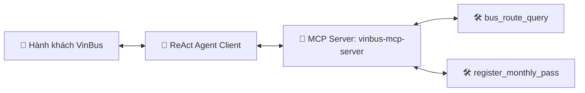

# 🎬 KỊCH BẢN THUYẾT TRÌNH & LIVE DEMO DỰ ÁN VINBUS REACT AGENT (MCP ENHANCED)
> **Đề tài:** Trợ lý Dịch vụ Khách hàng VinBus — Tra cứu lộ trình xe bus điện và đăng ký vé tháng.  
> **Học viên thực hiện:** Nguyễn Như Tài (MSSV: 2A202602976)  
> **Thời lượng demo gợi ý:** 3 – 5 phút

---

## 📌 TỔNG QUAN BÁO CÁO KỸ THUẬT



- **LLM Provider:** OpenAI API (`OpenAIProvider` / `gpt-4o-mini`)
- **Kiến trúc:** Model Context Protocol (MCP Client - Server JSON-RPC 2.0)
- **Vòng lặp ReAct:** `Thought` ➡️ `Action` ➡️ `Observation` ➡️ `Final Answer`

---

## 🎤 KỊCH BẢN LỜI THOẠI & THAO TÁC THEO TỪNG PHẦN (3-5 PHÚT)

### ⏱️ PHẦN 1: GIỚI THIỆU BÀI TOÁN & ĐÁNH GIÁ AGENTIC FIT (1 PHÚT)

#### 🗣️ Lời thoại trình bày:
> *"Em xin chào Thầy/Cô và các bạn. Hôm nay em xin trình bày dự án **Trợ lý Tác tử Dịch vụ Khách hàng VinBus**. Bài toán được thiết kế để giải quyết nhu cầu tra cứu thông tin lộ trình tuyến xe bus điện thời gian thực và tự động hóa quy trình đăng ký vé tháng cho hành khách."*
>
> *"Trước khi triển khai, em đã đánh giá bài toán qua ma trận **Agentic Fit Scoring Matrix** và đạt **17/20 điểm**:"*
> - **Multi-step Reasoning (4/5):** Cần suy luận đa bước khi tìm tuyến xe phù hợp ➔ chuyển sang đăng ký vé tháng.
> - **Tool Interaction (5/5):** Bắt buộc kết nối CSDL qua MCP Server để lấy dữ liệu lộ trình chính xác.
> - **Dynamic Decision (4/5):** Quyết định bước tiếp theo dựa trên kết quả tra cứu của công cụ (Observation).
> - **Long Horizon Goal (4/5):** Giữ vững mục tiêu hoàn tất thủ tục đăng ký vé tháng cho khách.

---

### ⏱️ PHẦN 2: THUYẾT TRÌNH KIẾN TRÚC HỆ THỐNG & MCP (1 PHÚT)

#### 🗣️ Lời thoại trình bày:
> *"Hệ thống được phát triển theo kiến trúc tác tử ReAct kết nối giao thức **Model Context Protocol (MCP)**:"*
> 1. **`src/tools.py`**: Định nghĩa 2 Tool Schemas chuẩn JSON Schema:
>    - `bus_route_query`: Tra cứu điểm đầu/cuối, giờ chạy, tần suất và lộ trình dừng.
>    - `register_monthly_pass`: Đăng ký vé tháng (Học sinh/Sinh viên, Người cao tuổi, Phổ thông).
> 2. **`src/mcp_server.py`**: MCP Server độc lập (`vinbus-customer-service-mcp-server`) xử lý request theo chuẩn JSON-RPC 2.0.
> 3. **`src/app.py`**: ReAct Agent Core liên kết với OpenAI LLM Provider điều phối vòng lặp suy luận.

---

### ⏱️ PHẦN 3: LIVE DEMO THỰC TẾ TRÊN TERMINAL (2 PHÚT)

#### 💻 Thao tác mở Demo:
Mở Terminal tại thư mục dự án và chạy lệnh:
```powershell
.venv\Scripts\python.exe src/app.py --interactive
```

---

#### 🧪 DEMO 1: Tra cứu lộ trình tuyến xe bus điện (Single Tool Query)
- **Prompt gõ vào Terminal:**
  ```text
  Hãy tra cứu lộ trình, điểm dừng và thời gian hoạt động của tuyến xe bus điện VinBus E01.
  ```
- **🗣️ Lời thoại giải thích khi Agent chạy:**
  > *"Như Thầy/Cô thấy trên màn hình, Agent không bịa ra câu trả lời mà đưa ra suy luận `Thought`: Cần tra cứu lộ trình tuyến E01. Sau đó phát sinh `Action Proposed` gọi tool `bus_route_query({'route_id': 'E01'})` tới MCP Server và nhận dữ liệu `Observation` thực tế để tổng hợp câu trả lời chuẩn xác."*

---

#### 🧪 DEMO 2: Đăng ký vé tháng xe bus điện (Action Tool Execution)
- **Prompt gõ vào Terminal:**
  ```text
  Tôi muốn đăng ký vé tháng tuyến E01 cho hành khách Nguyễn Văn An, SĐT 0912345678, đối tượng Học sinh/Sinh viên từ tháng 10/2026.
  ```
- **🗣️ Lời thoại giải thích khi Agent chạy:**
  > *"Ở kịch bản này, Agent tự động trích xuất các tham số từ câu hỏi tự nhiên của khách hàng (`passenger_name`, `phone_number`, `pass_type`, `start_month`), kích hoạt tool `register_monthly_pass` và trả về mã đăng ký `VB-PASS-5678` cùng mức phí ưu đãi 100.000 VNĐ/tháng."*

---

#### 🧪 DEMO 3: Xử lý ngoại lệ / Không tồn tại (Anti-Hallucination & Edge Case)
- **Prompt gõ vào Terminal:**
  ```text
  Hãy tra cứu thông tin lộ trình của tuyến xe bus VinBus E999.
  ```
- **🗣️ Lời thoại giải thích khi Agent chạy:**
  > *"Khi tra cứu tuyến E999 không tồn tại trong hệ thống, MCP Server trả về trạng thái `NOT_FOUND`. Agent tiếp nhận quan sát này và phản hồi lịch sự, trung thực rằng tuyến E999 chưa hỗ trợ, thể hiện khả năng chống ảo giác (Anti-Hallucination) tuyệt đối."*

---

### ⏱️ PHẦN 4: NÊU BẰNG CHỨNG WATERFALL TRACE LOG & KẾT LUẬN (1 PHÚT)

#### 🗣️ Lời thoại trình bày:
> *"Toàn bộ chuỗi suy luận của Agent trong phiên vừa rồi đều được tự động lưu lại tại tệp **`docs/trace_waterfall.json`**. File log thể hiện minh bạch từng bước `step`, loại hành động `action_type`, tham số truyền vào và thời gian phản hồi `latency_ms` của LLM."*
>
> *"Dự án đã chạy thành công 5/5 Test Cases nghiệm thu trên OpenAI API thật. Em xin chân thành cảm ơn Thầy/Cô đã lắng nghe!"*

---

## 📋 CHEATSHEET COPY-PASTE CÁC CÂU LỆNH KHI DEMO

### 1. Chạy nghiệm thu toàn bộ Test Suite:
```powershell
.venv\Scripts\python.exe src/app.py --all
```

### 2. Chạy Chat đàm thoại trực tiếp (Interactive CLI):
```powershell
.venv\Scripts\python.exe src/app.py --interactive
```

### 3. Bộ 3 câu Prompt thần thánh copy-paste nhanh khi Demo:

| STT | Kịch bản Demo | Câu Prompt gõ vào Terminal |
| :---: | :--- | :--- |
| **Prompt 1** | Tra cứu tuyến E01 | `Hãy tra cứu lộ trình, điểm dừng và thời gian hoạt động của tuyến xe bus điện VinBus E01.` |
| **Prompt 2** | Đăng ký vé tháng | `Tôi muốn đăng ký vé tháng tuyến E01 cho hành khách Nguyễn Văn An, SĐT 0912345678, đối tượng Học sinh/Sinh viên từ tháng 10/2026.` |
| **Prompt 3** | Test lỗi tuyến E999 | `Hãy tra cứu thông tin lộ trình của tuyến xe bus VinBus E999.` |
